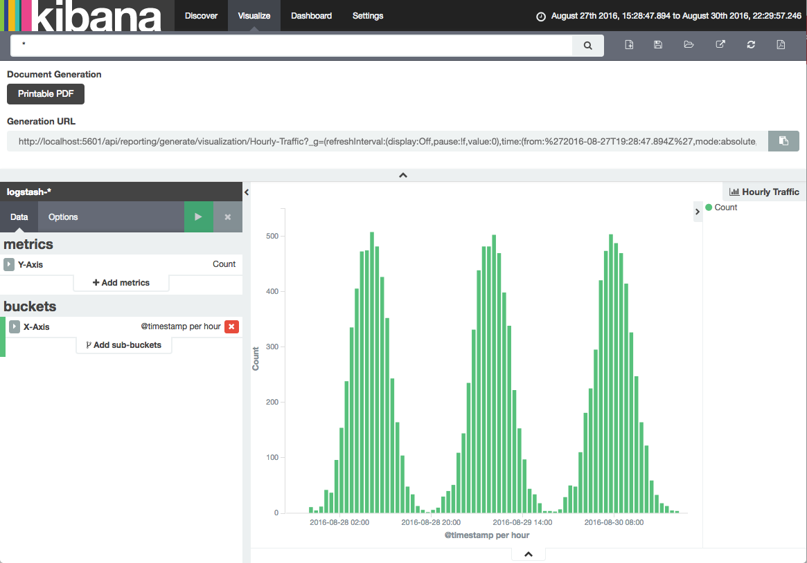

+++
title = "Logging with the Elastic Stack"
description = "The Elastic stack, also known as the ELK stack, has become a wide-spread tool for aggregating logs. This recipe helps you to set it up in Kubernetes."
date = "2016-11-21"
type = "page"
weight = 50
tags = ["recipe"]
+++

# Logging with the Elastic Stack

The Elastic stack, most prominently know as the ELK stack, in this recipe is the combination of Filebeat, Elasticsearch, and Kibana. This stack helps you get all logs from your containers into a single searchable data store without having to worry about logs disappearing together with the containers. With Kibana you get a nice analytics and visualization platform on top.



## Deploying Elasticsearch, Filebeat, and Kibana

First we create a namespace and deploy our manifests to it.

```bash
kubectl apply \
  --filename https://raw.githubusercontent.com/giantswarm/kubernetes-elastic-stack/master/manifests-all.yaml
```

## Configuring Kibana

Now we need to open up Kibana. As we have no authentication set up in this recipe (you can check out [Shield](https://www.elastic.co/products/x-pack/security) for that), we access Kibana through

```nohighlight
$ POD=$(kubectl get pods --namespace logging --selector component=kibana \
    -o template --template '{{range .items}}{{.metadata.name}} {{.status.phase}}{{"\n"}}{{end}}' \
    | grep Running | head -1 | cut -f1 -d' ')
$ kubectl port-forward --namespace logging $POD 5601:5601
```

Now you can open up your browser at `http://localhost:5601/app/kibana/` and access the Kibana frontend.

Now set `filebeat-*` for `index pattern`.

Then, we can choose `json.time` for `time-field name` below.

All set! You can now use Kibana to access your logs including filtering logs based on pod names and namespaces.

## Configuring Curator to change log retention

Included in this recipe, there is a Scheduled Job running [Curator](https://github.com/elastic/curator) once a day to clean up your logs. The pod is set to run at 1 minute past midnight and delete indices that are older than 3 days.

You can change this by editing the ConfigMap named `curator-config`. The definition of the `action_file.yaml` is quite self-explaining for simple set ups. For more advanced configuration options, please consult the [Curator Documentation](https://www.elastic.co/guide/en/elasticsearch/client/curator/current/index.html).
